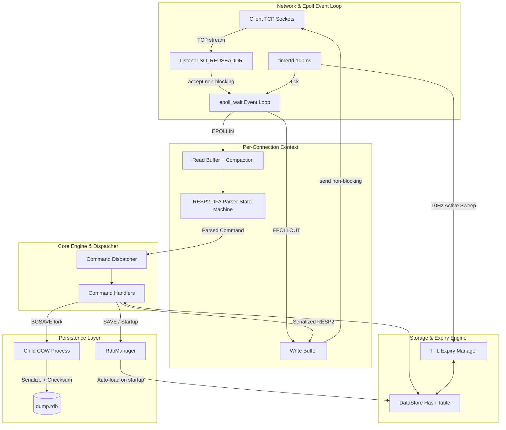

# mini-redis-cpp

An in-memory, event-driven Redis server clone built from scratch in modern **C++20** using Linux **POSIX non-blocking I/O (`epoll`)**.

Designed to demonstrate systems-level software engineering: low-level socket programming, deterministic state machines, asynchronous event dispatching, memory-safe data structures, and persistence with zero external third-party dependencies.

---

## Technical Highlights

- **Single-Threaded Event Loop (`epoll`)**: Eliminates mutex contention, cache ping-pong, and context switching overhead. Uses Level-Triggered `epoll` with dynamic on-demand `EPOLLOUT` registration for non-blocking partial writes.
- **DFA RESP2 Wire Protocol Parser**: Deterministic Finite Automaton (state machine) streaming parser supporting pipelining, chunked/fragmented TCP streams, and protocol validation.
- **Dual Expiry Engine (TTL)**:
  - **Lazy Eviction**: Expired keys are checked and purged on access in $\mathcal{O}(1)$ time.
  - **Active Expiry Sweep**: Periodic probabilistic sampling (Redis algorithm) driven by POSIX `timerfd` at 10Hz without blocking request processing.
- **RDB Snapshot Persistence & Linux COW**:
  - `SAVE`: Synchronous snapshot generation to atomic temporary files.
  - `BGSAVE`: Asynchronous snapshot using Linux `fork()` Copy-On-Write (COW) semantics; parent server reaps child processes non-blockingly via `waitpid(WNOHANG)`.
  - **Integrity**: 64-bit FNV-1a checksum validation and magic header verification.
- **Self-Healing Configuration System**: Automatically creates default configuration files on first run, repairs missing directives on the fly, and recovers corrupted configurations via `.bak` timestamped backups.
- **Production-Grade Resilience**:
  - Per-connection DoS buffer caps to prevent memory exhaustion attacks.
  - Amortized buffer compaction to eliminate heap fragmentation.
  - Idle client connection timeouts.
  - Async-signal-safe graceful shutdown (`SIGINT`, `SIGTERM`).
  - Strict compilation under `-Wall -Wextra -Werror` in C++20 standard.

---

## Architecture Overview



---

## Performance Benchmarks

Benchmarked on Linux x86_64 using native concurrent client load generator (`mini_redis_benchmark`) with 50 concurrent connections, 100,000 requests per suite, and `TCP_NODELAY` enabled:

| Command | Requests | Duration | Throughput (RPS) | Min Latency | Avg Latency | p50 (Median) | p99 Latency |
|:---|:---:|:---:|:---:|:---:|:---:|:---:|:---:|
| **PING** | 100,000 | 0.800 s | **124,959.51** | 0.018 ms | 0.390 ms | 0.383 ms | **0.772 ms** |
| **SET**  | 100,000 | 0.940 s | **106,330.77** | 0.016 ms | 0.456 ms | 0.438 ms | **0.883 ms** |
| **GET**  | 100,000 | 0.968 s | **103,354.44** | 0.017 ms | 0.470 ms | 0.460 ms | **0.927 ms** |
| **INCR** | 100,000 | 0.936 s | **106,886.39** | 0.019 ms | 0.456 ms | 0.438 ms | **0.897 ms** |

> **Result**: Stable **>100,000 RPS** with sub-millisecond p99 latency across all core key-value operations. Detailed percentile reports are documented in [benchmarks/results.md](benchmarks/results.md).

---

## Supported Commands

Full interoperability with official `redis-cli` and third-party Redis drivers:

| Category | Commands | Description |
|:---|:---|:---|
| **System & Utility** | `PING`, `ECHO`, `COMMAND`, `COMMAND DOCS`, `COMMAND COUNT` | Connection testing, message echo, and redis-cli handshake |
| **Key-Value Store** | `SET`, `GET`, `DEL`, `EXISTS`, `INCR`, `TYPE`, `FLUSHALL` | String manipulation, integer counters, bulk queries, deletion |
| **TTL & Expiry** | `EXPIRE`, `TTL`, `PERSIST` | Key expiration in seconds, TTL querying, TTL removal |
| **Persistence** | `SAVE`, `BGSAVE` | Synchronous snapshotting and non-blocking background snapshotting |

---

## Configuration & Self-Healing Engine

`mini-redis` manages its own configuration file (`mini-redis.conf`) with automatic repair capabilities:

```ini
# mini-redis configuration file
bind 127.0.0.1
port 6379
timeout 300
loglevel info
max-buffer-size 1048576
active-expire-interval-ms 100
compact-threshold 32768
shrink-threshold 65536
```

- **First-run Auto-generation**: If `mini-redis.conf` does not exist, the server automatically generates a documented configuration template.
- **Missing-line Auto-repair**: If lines or directives are deleted, the server appends default values automatically without overwriting existing settings.
- **Corruption Recovery**: If the configuration contains unparseable syntax, `mini-redis` creates a timestamped `.bak` copy and regenerates a valid configuration.

---

## Building and Testing

### Prerequisites
- Linux OS with Kernel 3.17+ (for `timerfd` and `epoll_create1`)
- GCC $\ge 11$ or Clang $\ge 14$ supporting **C++20**
- CMake $\ge 3.20$
- Python 3 (for integration testing)

### Build
```bash
# Clone the repository
git clone https://github.com/dtduy23/mini-redis.git
cd mini-redis/mini-redis-cpp

# Configure and compile
cmake -B build -DCMAKE_BUILD_TYPE=Release
cmake --build build -j$(nproc)
```

### Running Unit Tests
```bash
ctest --test-dir build --output-on-failure
```
Runs test suites covering RESP parsing, state transitions, data store operations, active/lazy TTL expiry, self-healing config, and RDB snapshot serialization/checksum verification.

### Running End-to-End Network Tests
```bash
python3 tests/test_server_e2e.py
```
Validates real socket communication, protocol serialization, pipeline execution, client idle timeouts, active expiry sweeps, concurrency, and persistence recovery upon server restart.

### Running the Benchmark Suite
```bash
# Start the server in the background
./build/src/mini_redis_cpp &

# Execute concurrent benchmark (50 clients, 100,000 requests)
./build/src/mini_redis_benchmark -p 6379 -c 50 -n 100000
```

---

## Project Structure

```text
mini-redis-cpp/
├── benchmarks/
│   └── results.md             # Benchmark numbers, percentiles, analysis
├── docs/
│   └── requirements.md        # Detailed requirements specification
├── src/
│   ├── benchmark/
│   │   └── benchmark.cpp      # Native high-performance benchmark tool
│   ├── commands/
│   │   ├── dispatcher.hpp/.cpp# Command routing and arity validation
│   │   └── handlers.hpp/.cpp  # Command logic (SET, GET, TTL, SAVE, etc.)
│   ├── config/
│   │   └── config.hpp/.cpp    # Configuration loader & self-healing engine
│   ├── protocol/
│   │   ├── resp_parser.hpp/.cpp    # RESP2 streaming state machine
│   │   └── resp_serializer.hpp/.cpp# RESP2 protocol serializer
│   ├── server/
│   │   ├── connection.hpp/.cpp# Per-client buffers and parser state
│   │   ├── event_loop.hpp/.cpp# epoll event loop & timerfd handler
│   │   ├── listener.hpp/.cpp  # TCP socket binding & listen
│   │   └── logging.hpp        # Fast zero-dependency structured logger
│   ├── store/
│   │   ├── data_store.hpp/.cpp# In-memory key-value hash table
│   │   ├── expiry.hpp/.cpp    # Active & lazy TTL eviction manager
│   │   └── rdb.hpp/.cpp       # RDB snapshot serialization & COW engine
│   └── main.cpp               # CLI parsing, signal handling, entry point
└── tests/
    ├── test_resp_parser.cpp   # Unit tests: protocol streaming & edge cases
    ├── test_data_store.cpp    # Unit tests: KV store & command dispatch
    ├── test_expiry.cpp        # Unit tests: TTL active & lazy eviction
    ├── test_config.cpp        # Unit tests: self-healing configuration
    ├── test_rdb.cpp           # Unit tests: snapshot, checksum, bgsave
    └── test_server_e2e.py     # Python E2E socket integration tests
```

---

## License

MIT License. Designed and developed as a modern, high-performance systems programming project.
